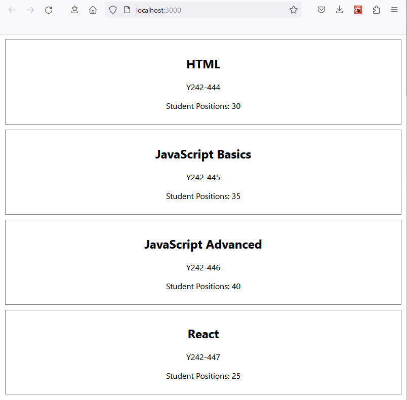

# Week Exercise 2

To goal of this exercise is to practise and demonstrate you skills in react component usage, passing and using object data to components via props.

How to start:

- Clone this project to your own computer with git,
- Install the dependecies with 'npm install',
- Write the solution for the task,
- Test it on your machine with 'npm run test' and confirm that you pass all the test cases,
- Finally commit and push your changes to the github classroom repository

The outcome of a working application should look like in the example image below:


## Task Description

You will create a React application that displays a list of courses offered by a school, club, or similar organization. This exercise will help you understand how to:

- Render React components.
- Pass and handle object data via props.
- Organize components into a logical structure.

### Application Requirements

- The application should display a list of courses, with no limit on the number of courses.
- Each course should display:
  - Course name
  - Course ID
  - Number of available student positions
- Styling for each course should include:
  - `padding: 10px`
  - `margin: 10px`
  - `text-align: center`
  - `border: 1px solid gray`
- No interactivity is required; only the static rendering of the courses is necessary.

### Component Structure

- **App Component:**

  - Receives a `courses` prop, an array of course objects. The object structure is as follows:
    ```js
    {
      name: "Course Name",
      courseId: "Course ID",
      studentPositions: X,
    }
    ```
  - Forwards the `courses` prop to the `CourseList` component.

- **CourseList Component:**

  - Receives the `courses` prop from the `App` component.
  - Is located in the src folder
  - Renders a `Course` component for each course in the `courses` array, passing the course's `name`, `courseId`, and `studentPositions` as individual props to the `Course` component.

- **Course Component:**
  - Receives three props: `name`, `courseId`, and `studentPositions`.
  - Is located in the src folder
  - Renders the following DOM structure:
    ```jsx
    <div className="course">
      <h2>{name}</h2>
      <p>{courseId}</p>
      <p>Student Positions: {studentPositions}</p>
    </div>
    ```

### Expected Output

The final output should resemble the following structure:

```html
<div class="course">
  <h2>Course Name</h2>
  <p>Course ID</p>
  <p>Student Positions: X</p>
</div>
```

## Available Scripts

In the project directory, you can run:

### `npm run dev`

Runs the app in the development mode.\
Open [http://localhost:3000](http://localhost:3000) to view it in your browser.

The page will reload when you make changes.\
You may also see any lint errors in the console.

### `npm run test`

Launches the test runner in the interactive watch mode.\
See the section about [running tests](https://facebook.github.io/create-react-app/docs/running-tests) for more information.
